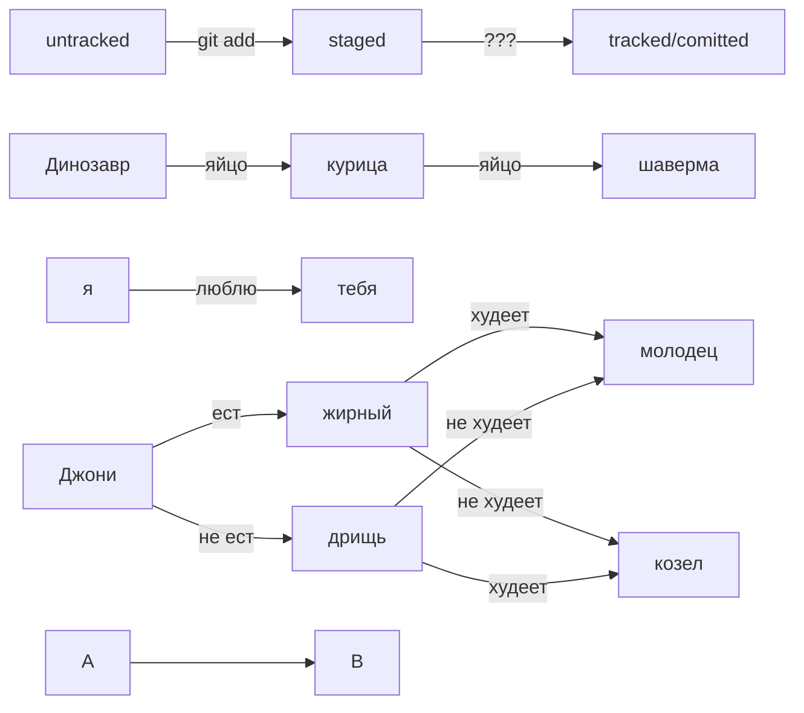

# Шпаргалка

## 1 Раздел, знакомство с git

### Навигация

pwd (от англ. print working directory, «показать рабочую папку») — покажи, в какой я папке;

ls (от англ. list directory contents, «отобразить содержимое директории») — покажи файлы и папки в текущей папке;

ls -a — покажи также скрытые файлы и папки, названия которых начинаются с символа .;
cd first-project (от англ. change directory, «сменить директорию») — перейди в папку first-project;

cd first-project/html — перейди в папку html, которая находится в папке first-project;

cd .. — перейди на уровень выше, в родительскую папку;

cd ~ — перейди в домашнюю директорию (/Users/Username);

cd / — перейди в корневую директорию.

## Работа с файлами и папками

### Создание

touch index.html (англ. touch, «коснуться») — создай файл index.html в текущей папке;

touch index.html style.css script.js — если нужно создать сразу несколько файлов, можно напечатать их имена в одну строку через пробел;

mkdir second-project (от англ. make directory, «создать директорию») — создай папку с именем second-project в текущей папке.

### Копирование и перемещение

cp file.txt ~/my-dir (от англ. copy, «копировать») — скопируй файл в другое место;

mv file.txt ~/my-dir (от англ. move, «переместить») — перемести файл или папку в другое место.

### Чтение

cat file.txt (от англ. concatenate and print, «объединить и распечатать») — распечатай содержимое текстового файла file.txt.

### Удаление

rm about.html (от англ. remove, «удалить») — удали файл about.html;

rmdir images (от англ. remove directory, «удалить директорию») — удали папку images;

rm -r second-project (от англ. remove, «удалить» + recursive, «рекурсивный») — удали папку second-project и всё, что она содержит.

## Полезные возможности

Команды необязательно печатать и выполнять по очереди. Можно указать их списком — разделить двумя амперсандами (&&).

У консоли есть собственная память — буфер с несколькими последними командами. По ним можно перемещаться с помощью клавиш со стрелками вверх (↑) и вниз (↓).

Чтобы не вводить название файла или папки полностью, можно набрать первые символы имени и дважды нажать Tab. Если файл или папка есть в текущей директории, командная строка допишет путь сама.

Например, вы находитесь в папке dev. Начните вводить cd first и дважды нажмите Tab. Если папка first-project есть внутри dev, командная строка автоматически подставит её имя. Останется только нажать Enter.

## 2 раздел, начало работы с Git

### ХЭШ

Git преобразует информацию о коммитах с помощью алгоритма SHA-1 и для каждого из них рассчитывает уникальный идентификатор — хеш.

Хеш — основной идентификатор коммита и позволяет узнать его автора, дату и содержимое закоммиченных файлов.

Все хеши, а также таблицу соответствий хеш → информация о коммите Git хранит в папке .git.

### Разбираем LOG

Разберём элементы, из которых состоит описание:

строка из цифр и латинских букв после слова commit — это хеш коммита;

Author — имя автора и его электронная почта;

Date — дата и время создания коммита;

в конце находится сообщение коммита.

Можно вызвать не только полный лог, но и сокращённый — это делается командой git log --oneline.

В сокращённом логе выводятся сокращённые хеши — их можно использовать точно так же, как и полные.

### HEAD 

Файл HEAD (англ. «голова», «головной») — один из служебных файлов папки .git. Он указывает на коммит, который сделан последним (то есть на самый новый).

В числе прочих файлов в папке .git есть служебный файл HEAD. Он указывает на самый свежий коммит.

Вместо хеша последнего коммита можно написать слово HEAD — Git вас поймёт.

### Статусы файлов в Git

Статусом untracked помечается файл, о существовании которого Git знает, но не следит за изменениями в нём. Этот статус — противоположность tracked, в который попадают все файлы, отслеживаемые Git.

Файл переходит в статус staged после выполнения git add.

Статус modified означает, что файл был изменён.

Большинство файлов в проектах «шагает» по следующему циклу: «изменён» → «добавлен в список на коммит» → «закоммичен» → «изменён» → и так далее.

Команда git status всегда подскажет, что происходит с файлом: например, он добавлен в список «на коммит» или ещё вообще не отслеживается, или изменён.

git status показывает явно следующие состояния файлов: untracked, staged и modified.

git status подсказывает, какие команды можно выполнить, чтобы поменять состояние файла.

### Оформление сообщений к коммитам

#### Корпоративный

Во многих компаниях применяется Jira — система для организации проектов и задач. У каждой задачи в Jira есть идентификатор из нескольких заглавных латинских букв и номера. Например, LGS-239 значит, что это 239

239-я задача в проекте LGS (сокращение от англ. logistics — «логистика»).

В корпоративном стиле в начале сообщения обычно указывают Jira-ID, а после — текст сообщения.

$ git commit -m "LGS-239: Дополнить список пасхалок новыми числами" 

#### Conventional Commits

тандарт Conventional Commits (англ. «соглашение о коммитах») отличается качественной документацией и подробной проработкой. Он подходит для репозиториев с исходным кодом программ. Использовать его для других типов проектов (например, для перевода книги) было бы неудобно.

Conventional Commits предлагает такой формат коммита: <type>: <сообщение>. Первая часть type — это тип изменений. Таких типов достаточно много. 
Вот два примера:
feat (сокращение от англ. feature) — для новой функциональности;

fix (от англ. «исправить», «устранить») — для исправленных ошибок.

Более подробный список можно увидеть на сайте с описанием этого стиля.

Например, сообщение может быть таким.

git commit -m "feat: добавить подсчёт суммы заказов за неделю" 

#### GitHub-стиль

GitHub можно использовать не только для хранения файлов проекта, но и для ведения списка задач (англ. issue) этого проекта. Если коммит «закрывает» или «решает» какую-то задачу, то в его сообщении удобно указывать ссылку на неё. Для этого в любом месте сообщения нужно указать #<номер задачи>.

Например, вот так.

$ git commit -m "Исправить #334, добавить график температуры"

HEAD -- это голова.
Коммит -- это всему голова.
Статусы файлов:
<тут пустая строка!>

<и тут пустая строка!> 
